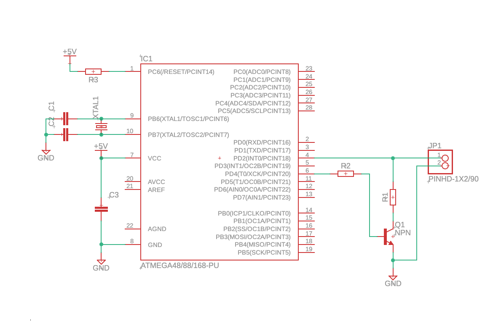

# iButton (Dallas Touch Memory DS1990) emulator

This is a simple device consisting from an AVR MCU and a transistor that emulates DS1990 key with arbitrary serail number written to EEPROM. This is just a pet project, not a production reade device programm. 

## Purpose of this device

I`ve got my ibutton key broken, it was retrieving a wrong code. But I knew the right code and had to get a RW1990 programmed with this code. In my city nobody had an iButton programmer that can write arbitrary code into a key,
they only offered me to copy serial number from an existent key. So I created this device and then using a key duplication device programmed my new RW1990 key.

**This device is not intended for illegal entry.**

## Schematics 

Device is build upon an AVR ATMega168-20PU MCU, just becuse I had it in my workshop. In fact this program could be run on any AVR with one external interruption and another free general IO pin
(with respect to register names and pin number), for example ATTiny 25.



Transisor used to pull the line down to the ground by a separate pin. This simplifies the programm because this way we have not to change _DDRx_ durign the session.

## Building and firmware loading

I created Makefile for building and programming my MCU, if you need you can change MCU type and programmer.

## Loading the serail number

Serial iButton number is stored within EEPROM of the MCU. To set the number create _ihex_ file `serial.eep` and write its conent to the MCU EEPROM using your firmware loading device:

```ihex
:0800010028FF5DDC631603C755
:00000001FF
```
`28FF5DDC631603C7` - replace with your 8 bit serial, `55` - CRC of the serail number